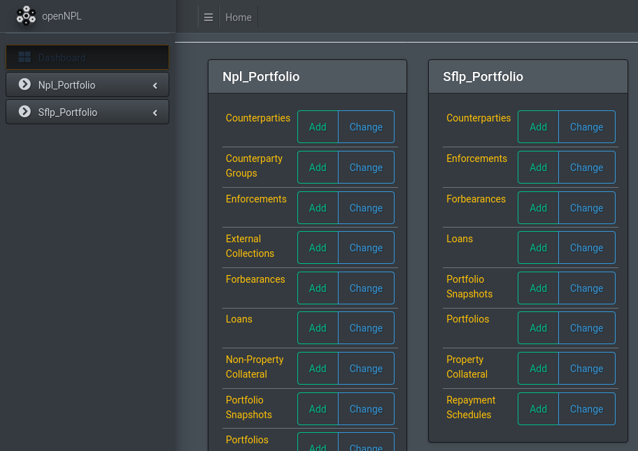

Usage
==============================
The openNPL platform offers a lot of functionality. Here we break down some of the main workflows for those just getting started with the platform. More will detailed tutorials will follow as the platform develops!

.. seealso:: For more in-depth studies on using python for credit portfolio management check-out: `Open Risk Academy <https://www.openriskacademy.com/login/index.php>`_. For Non-performing loan data domain knowledge check out the relevant entries at the: `Open Risk Manual <https://www.openriskmanual.org/wiki/Category:NPL>`_

The landing page
---------------------
If everything went well with the installation, upon pointing your browser to localhost:8000 (or whatever port you are using) you will meet the landing page:

Login
-----
To log-in, point your browser to localhost:8000/admin (initially only an admin user is enabled). This will get you to the login page:

.. image:: ./screenshots/login.png

If you used the default demo credentials for openNPL you can login using:

-   **Login:** admin
-   **Password:** admin

Admin Interface
---------------
After a successful login you will get to the admin interface which offers access to all the datasets:

.. image:: ./screenshots/admin.png

The interface provides access to:

* administrative functions like creating users and groups
* a history log of activities that have been performed
* user functions like inspecting and working with NPL data

Lets click first on an important data model under the EBA portfolio collection: The **Counterparty** model. This gets us to a list of (randomly generated) counterparties that have been inserted into the database during the installation process:

Counterparty Data
-----------------

.. image:: ./screenshots/counterparty.png

Some key functionalities available in this view are (in summary)

* viewing (sorting) counterparty data (meaning obligor or borrower data, e.g. company or individual person data)
* adding new records
* deleting new records

.. note:: this view selects only some illustrative fields out of the many recorded in the database

Lets click into any counterparty row to take a closer look:

.. image:: ./screenshots/counterparty_detail.png

All the available EBA counterparty fields are available in this view to inspect and potentially change.

.. note::  If any field is unclear, clicking on the *Documentation link* underneath takes you to the Open Risk Manual for the explanation. For example if we click on **Annual Revenue** field, we will get to the corresponding page that explains the meaning and requirements for this data point

.. image:: ./screenshots/manual.png

We can go back to the overview of all data by clicking on the breadcrumb (EBA Portfolio) or pointing the
browser to http://localhost:8001/admin/eba_portfolio/

Lets take a look now at another important data model, namely the **Loan** model data. Loans is one of the main financial products documented in the templates (others being leases and swaps):

Loan Data
----------

.. image:: ./screenshots/loan.png

The layout is similar to what we have seen before. A selection of fields is visible in the overview and
clicking through we get access to further data, e.g. which counterparty actually holds to the loan.

In the upper right corner we have the functionality for filtering the dataset. Clicking on the menu allows
selecting the desired filter to narrow down the portfolio:

.. image:: ./screenshots/filter.png

As one final example lets go back to the main list and select the **Property Collateral** data (in the EBA
templates collateral is segmented along property and non-property classes):

Property Collateral Data
------------------------

By now the familiar table display of the stored collateral data should show up:

.. image:: ./screenshots/collateral.png

Lets try now something more adventurous! Let us try to **add** some data!

Click on the add data button on the upper right side of the page. You should see a form with many empty fields:

.. image:: ./screenshots/adding.png

Depending on the nature of the field you can either enter text, numbers or select entries from drop-down
menus. Whenever there is doubt, the documentation link is as before one click away!